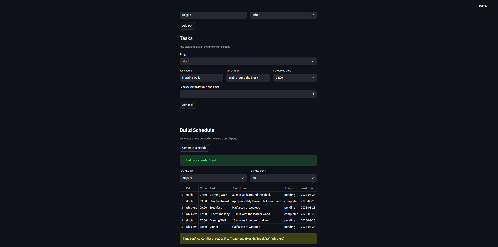

# PawPal+ (Module 2 Project)

You are building **PawPal+**, a Streamlit app that helps a pet owner plan care tasks for their pet.

## Scenario

A busy pet owner needs help staying consistent with pet care. They want an assistant that can:

- Track pet care tasks (walks, feeding, meds, enrichment, grooming, etc.)
- Consider constraints (time available, priority, owner preferences)
- Produce a daily plan and explain why it chose that plan

Your job is to design the system first (UML), then implement the logic in Python, then connect it to the Streamlit UI.

## What you will build

Your final app should:

- Let a user enter basic owner + pet info
- Let a user add/edit tasks (duration + priority at minimum)
- Generate a daily schedule/plan based on constraints and priorities
- Display the plan clearly (and ideally explain the reasoning)
- Include tests for the most important scheduling behaviors

## Getting started

### Setup

```bash
python -m venv .venv
source .venv/bin/activate  # Windows: .venv\Scripts\activate
pip install -r requirements.txt
```

### Suggested workflow

1. Read the scenario carefully and identify requirements and edge cases.
2. Draft a UML diagram (classes, attributes, methods, relationships).
3. Convert UML into Python class stubs (no logic yet).
4. Implement scheduling logic in small increments.
5. Add tests to verify key behaviors.
6. Connect your logic to the Streamlit UI in `app.py`.
7. Refine UML so it matches what you actually built.

## Features

### Pet & Owner Management
- Register an owner and track multiple pets, each with a name and species
- Add pets at any time from the UI; the scheduler gains visibility into new pets instantly via a shared list reference between `Owner` and `Scheduler`
- The pet tracking table shows each pet's name, species, and current task count at a glance

### Task Management
- Add tasks to a single pet or to all pets simultaneously with one action
- Each task stores a name, description, scheduled time, recurrence frequency (in days), completion status, and next due date
- Recurring tasks (`frequency_days > 0`) automatically generate a new pending task for the next occurrence when marked complete, preserving the original as a permanent completed record
- One-time tasks (`frequency_days = 0`) are simply marked complete with no follow-up task created

### Schedule Generation
- Generates a time-ordered schedule across all pets using a sort on `scheduled_time`, regardless of the order tasks were inserted
- The generated schedule persists in session state and remains visible until explicitly regenerated, so changing filter controls does not trigger a re-query

### Schedule Filtering
- After a schedule is generated, filter the displayed results by pet, by completion status (All / Pending / Completed), or both simultaneously
- Filters operate on the already-generated schedule in memory — no round-trip to the scheduler on each filter change

### Conflict Detection
- After schedule generation, the scheduler groups all tasks by `scheduled_time` using `itertools.groupby` and reports any time slot with more than one task scheduled across any pets
- Conflicts are displayed as non-blocking warnings beneath the schedule table, identifying each conflicting task by name and pet

## Testing PawPal+

```bash
python -m pytest tests/test_pawpal.py
```

The test suite provided tests a myriad of different functions with different edge cases. It tests all methods of each class. 
- Task: Tests update methods
- Pet: Tests adding and removing tasks safely, as well as updating a non-existent task ID safely without crashing. 
- Scheduler: Tests pet management, task retrival, due date filtering, sorting time in ascending order, recurring time completion, edge cases for when there is unknown pet or unknown task, and conflict detection. 
- Owner, it tests adding a pet adds to both Owner and Scheduler's pet list, remvoing a pet removes from both, and both pet list fields reference the same list object.

**Confidence Level:** ⭐⭐⭐⭐

## 📸 Demo

<a href="screenshot.png" target="_blank"></a>